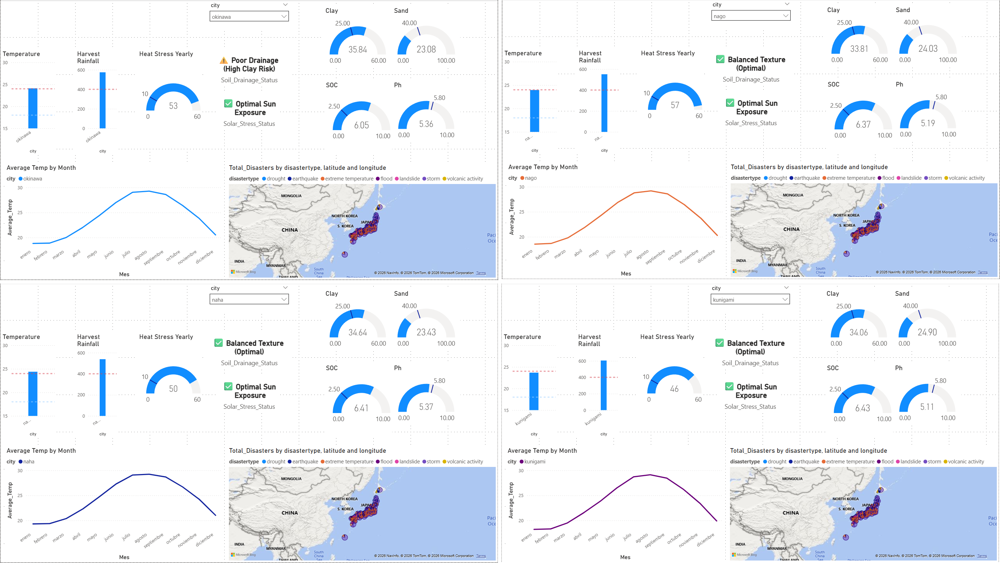

# Data Engineering Pipeline — Airflow + Docker + AWS + Power BI

Pipeline for the *ingestion*, *transformation*, and *analytical exposure* of climate data using **Airflow**, **AWS**, and **Power BI**.

## Problem Context

The project processes climate data coming from an external **API** and historical `csv` files. The main objective is to **centralize the information, clean it, and expose it** for analysis.

The project mainly focuses on the feasibility of coffee production in **Japan**, as it is currently one of the leading **Asian** countries that **imports the most coffee**. According to the [OEC](https://oec.world/en), in **2023** Japan imported approximately **USD 1.5 billion** worth of coffee, making it the largest coffee importer in Asia.

The data sources used are:

- [NASA Power API](https://power.larc.nasa.gov/docs/): To obtain meteorological data from a **public API**.
- [SoilGrids](https://soilgrids.org/): To obtain soil data in `tiff` format.
- [NASA Geocoded Disasters Dataset](https://www.earthdata.nasa.gov/data/catalog/sedac-ciesin-sedac-pend-gdis-1.00): To obtain historical natural disaster data in `csv` format.

## Architecture

The architecture follows an **ELT** approach where **Airflow** orchestrates ingestion and task execution, **S3** acts as a data lake, **Glue** manages transformations, and **Athena** enables analytical querying for consumption in **Power BI**.


## Why Airflow – AWS – Power BI?

- **Airflow:** Used to orchestrate sequential task execution. It allows scheduling periodic processes and coordinating file uploads to S3 once extraction is complete. In this project, it was especially useful for extracting data from APIs, converting it to Parquet format, and loading it into the *data lake*.
- **AWS:** Used to process data once stored in **S3**, a widely adopted service for building *data lakes*. The ecosystem includes **AWS Glue**, a *serverless* service that simplifies data cleaning and preparation. **Athena** is an interactive query service that allows data analysis directly on S3. Athena relies on the **AWS Glue Data Catalog** to identify schemas. Using **Crawlers**, the catalog is automatically updated, enabling Athena to discover and query the data stored in the *data lake*.
- **Power BI:** Used in the final stage to create *dashboards*, enabling data analysis and visualization. Its strong visualization capabilities facilitate data-driven decision-making.

## Data Flow

Within the data flow, three different formats are handled: **JSON, CSV, and TIFF**. For orchestration, **Airflow** runs inside a **Docker** container, allowing the environment to be replicated on any machine and ensuring project scalability.

- **JSON:** Public climate data is extracted from the NASA API using Airflow. The scope of the study covers the period 2014–2024 for the cities of Okinawa, Naha, Nago, and Kunigami. The data is transformed into **Parquet** format and loaded into **S3**.
- **CSV:** A global NASA dataset on natural disasters is processed. Airflow automates the conversion of these files to Parquet and their subsequent upload to S3.
- **TIFF:** As a raster format, the **rasterio** library is used to extract pixel-level information. Once converted to a tabular format, the data is transformed into Parquet and stored in S3.

Once the data resides in the `s3://raw-zone/` bucket, an **AWS Glue Crawler** is configured to update the **Data Catalog**, allowing **Athena** to infer schemas. SQL queries in Athena perform the necessary transformations and data cleaning, storing the results in the `s3://clean-zone/` bucket. Finally, **Power BI** connects to this zone for visualization and reporting.

## Data Modeling

Within the *data lake*, there are two buckets, **raw** and **clean**, used to store and segment different data states. This structure is essential for long-term organization and scalability.

- **raw-zone:** Receives only raw data obtained directly from APIs or CSV files downloaded from the web. Data remains untouched, serving as the single source of truth.
- **clean-zone:** Contains cleaned and processed data, ready for Power BI analysis. In this zone, null values are removed, inconsistencies are corrected, and tables are optimized. In this project, unnecessary columns were removed and *weather* data was partitioned by year to improve query performance.

## Data Quality

Data should never be blindly trusted; even reliable sources may contain unwanted values. Therefore, validating data integrity is critical. Data validation is performed using SQL, for example:

```sql
CASE
    WHEN TRY_CAST(latitude AS DOUBLE) BETWEEN -90 AND 90 THEN CAST(latitude AS DOUBLE)
    ELSE NULL
END AS latitude
```

Even when a field represents latitude, validating its range ensures data safety and integrity.

## Costs and Optimization

AWS charges for data scanned and compute capacity. One cost-optimization strategy in this project was running **Airflow inside a Docker container**, leveraging local resources instead of provisioning a managed cloud cluster, which is more expensive and complex to maintain. Containers also make the environment easily reproducible.

Additionally, since **Athena** charges based on the amount of data scanned, adopting the **Parquet** format was critical. This drastically reduced file sizes (for example, a 30 MB CSV was reduced to just 128 KB), making queries significantly faster and more cost-efficient.

## Trade-offs

- **Airflow Batch vs Streaming:** The current pipeline is orchestrated by Airflow, which is not designed for real-time processing. If near-real-time sensor data ingestion were required, Airflow would not be suitable. The pipeline is optimized for batch analytics. Low-latency requirements would require a streaming approach such as Kinesis, increasing both complexity and cost.
- **Glue + Athena vs Relational Databases:** Glue and Athena enable an on-demand, automatically scalable architecture. However, they are not ideal for low-latency workloads or highly repetitive query patterns on the same datasets. This project is analytical rather than transactional.
- **Automatic Crawlers vs Controlled Schemas:** Crawlers accelerate initial schema discovery by automatically detecting data types. However, they provide less control over schemas and increase the risk of representation errors in early production stages.
- **Raw + Clean Zones vs Direct Transformation:** Separating the *data lake* into Raw and Clean zones prioritizes traceability and reproducibility over simplicity, especially when data volumes are manageable.

## Data Consumers

This type of pipeline delivers significant value to data consumers by enabling measurements, predictions, and dashboards. Typical consumers include:

- Business Analysts
- Data Analysts
- Data Scientists (ML/AI)



## Limitations and Future Improvements

| Limitation | Impact | Improvements |
|-----------|--------|--------------|
| Pipeline designed for batch processing and does not support streaming use cases | Data availability has hours of latency, which is acceptable for historical analysis | For real-time, low-latency requirements, the pipeline could evolve toward streaming services such as Kinesis |
| Extraction relies mainly on Airflow execution timing | Data quality degradation (e.g., null values) is not proactively detected | Adding advanced data quality rules and historical metrics would enable early anomaly detection |

## Technical Takeaways

- Designing an ELT pipeline on a data lake improves scalability.
- Proper year-based partitioning of *weather* data significantly impacts performance and cost.
- Short-term architectural decisions are not necessarily optimal long-term without additional governance and controls.